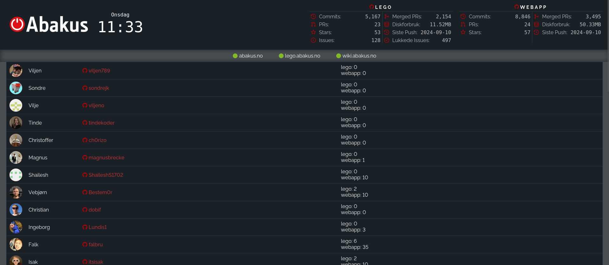

# Office Dashboard




The webkom office dashboard uses different data sources to display information about the office, its environment, and the members of the office.

_Do note that the dashboard and data sources require you to be on the NTNU network, either through VPN or at campus._

## Setup

```bash
# Teminal 1
yarn # install depedencies (do this once)
yarn dev # run frontend

# Terminal 2
cd office-dashboard-backend

cp config.template.py config.py # Add environment variabes for backend (do this once)
python -m venv venv # create venv (do this once)
source venv/bin/activate # enter venv
pip install -r requirements.txt # install dependencies (do this once)
python main.py # run backend
```

<details>
<summary>Archived docs</summary>

 

_<p align="center">laget med :beer: av webkom</p>_

## Data Sources

- #### Brus · [ GitHub](https://github.com/webkom/brus) · [:shipit: API](https://brus.abakus.no)

  Brus consits a record of transactions and the current balance of each of the members.

  The dashboard uses the [Brus API](https://brus.abakus.no) to display the amount of soda bottles and cans each member has bought over time.

- #### Environment · [ GitHub](https://github.com/webkom/environment-api) · [:shipit: API](https://environment-api.webkom.dev)

  Our office has a bunch of ESP32s with sensors (BME280 and CCS811) that record the environment data (temperature, pressure, humidity, eCO2 and TVOC). The sensor data is broadcast to our MQTT broker and gets recorded in InfluxDB with our Telegraf configuration.

  The dashboard uses the [Environment API](https://environment-api.webkom.dev) to retrieve the data stored in InfluxDB and displays it accordingly in the dashboard header.

- #### Kaffe · [ GitHub](https://github.com/webkom/kaffe-api) · [:shipit: API](https://kaffe-api.webkom.dev)

  Our office Moccamaster is connected to a TP-Link HS110, allowing us to measure the power usage of the Moccamaster. We have setup an Orange Pi Zero with a RFID card scanner application (written in Python) and a [script](https://github.com/webkom/kaffe-listener) (written in Elixir) that constantly listens to the power usage of the Moccamaster.
  Whenever a member scans their card (or anything with a RFID antenna) on the RFID reader, the RFID UID is broadcast over MQTT and stored in InfluxDB.
  Whenever coffee is brewed, the script estimates the volume by checking how long the brew took, and then sends a message to slack with who brewed and how much they brewed. The information about the brew is also broadcast back to MQTT for other consumers, where it is picked up by another script that stores the historical data in InfluxDB.

  The dashboard uses the [Kaffe API](https://kaffe-api.webkom.dev) to retrieve the data stored in InfluxDB and uses our [MaaS (Medlemmer as a Service)](https://github.com/webkom/medlemmer) to connect brew recordings (tagged with RFID UID) to a specific office member.

- #### Office door · [ GitHub](https://github.com/webkom/office-door-api) · [:shipit: API](https://office-door-api.webkom.dev)

  Our office door is setup with a simple ESP32, which resembles an open/closed switch. When the door is closed, there is a connection in the circuit, and if it's open, there's none. We broadcast this data to our MQTT broker, and have setup Telegraf to store this data in InfluxDB.
  The status is broadcast every 60 seconds if there is no change in the status. The ESP32 also uses a 4-digit 7-segment to display the amount of times the door has been opened, this counter is stored in memory via. ESP32 Preferences.

  The dashboard uses the [Office door API](https://office-door-api.webkom.dev) to retrieve the latest data stored in InfluxDB and displays the status of the door (open/closed) in the dashboard header.

- #### Office Chromecast · [ GitHub](https://github.com/webkom/office-chromecast-api) · [:shipit: API](https://office-chromecast-api.webkom.dev)

  We have an application running in our office _cloud_ (Orange PI Zeros running our [custom cloud script](https://github.com/webkom/CubeCometh)) that communicates with the Chromecast connected to our office TV and broadcasts the status of the Chromecast every 5 seconds to our MQTT broker. The data is then stored in InfluxDB via. Telegraf.
  If there is a song playing via. Spotify (or similiar) it is displayed accordingly on the dashboard (see the dashboard image above), the media banner is hidden if there is nothing playing on the Chromecast. The background and text colors of the media banner are generated based on the colors in the media image. Additionally, there's a simulated current duration that increases and syncs with the actual current time from Chromecast.

  The dashboard uses the [Office Chromecast API](https://office-chromecast-api.webkom.dev) to display the relevant media information.

- #### Presence · [ GitHub](https://github.com/webkom/presence-api) · [:shipit: API](https://presence.webkom.dev)

  Presence is an application that is also running in our office _cloud_ that constantly monitors the nearby WiFi and Bluetooth devices. It uses a set of whitelisted devices stored under each member in our [MaaS (Medlemmer as a Service)](https://github.com/webkom/medlemmer).
  Presence broadcasts (every 60 seconds) the list of (whitelisted) nearby devices to MQTT, which is then stored in InfluxDB via. Telegraf.

  The dashboard uses the [Presence API](https://presence.webkom.dev) to retrieve the data stored in InfluxDB and uses our [MaaS (Medlemmer as a Service)](https://github.com/webkom/medlemmer) to connect the devices to each member. It then calculates how long each member has been at the office since 06:00 AM, but also when the member was first seen (since 06:00 AM) and last seen at the office (as seen in the dashboard image above). The API also returns the name, avatar, GitHub username, Brus username and Slack username of each member.

</details>
